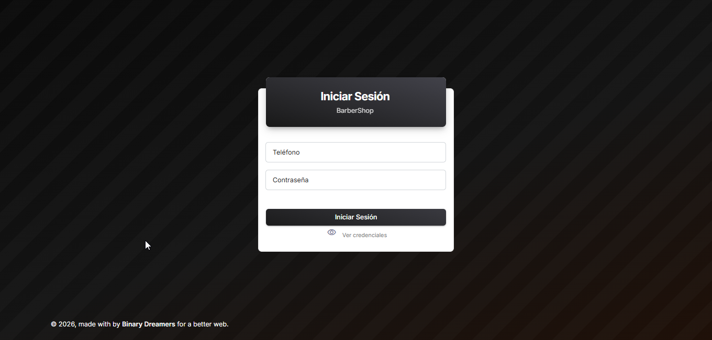
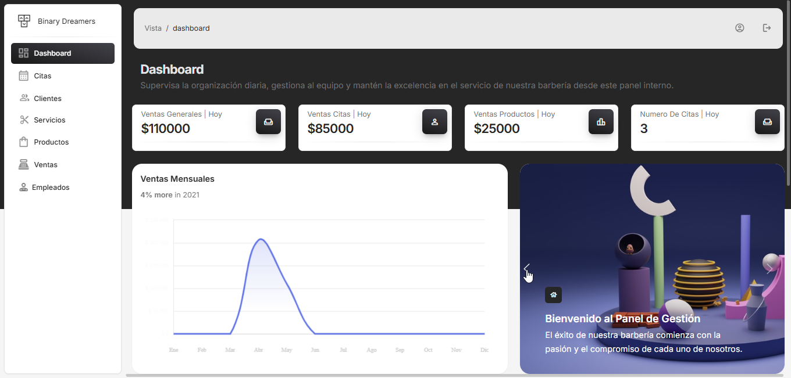
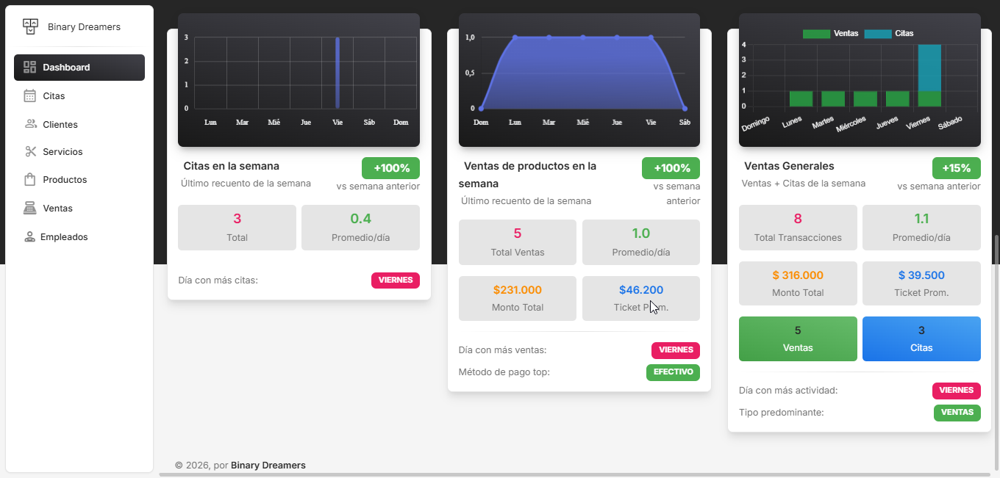
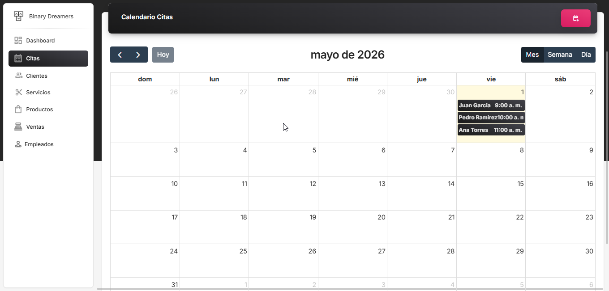
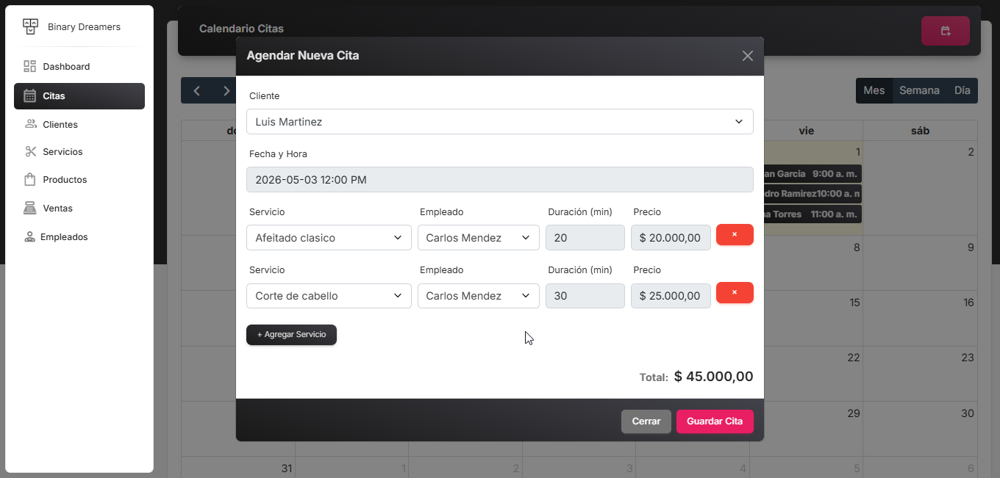
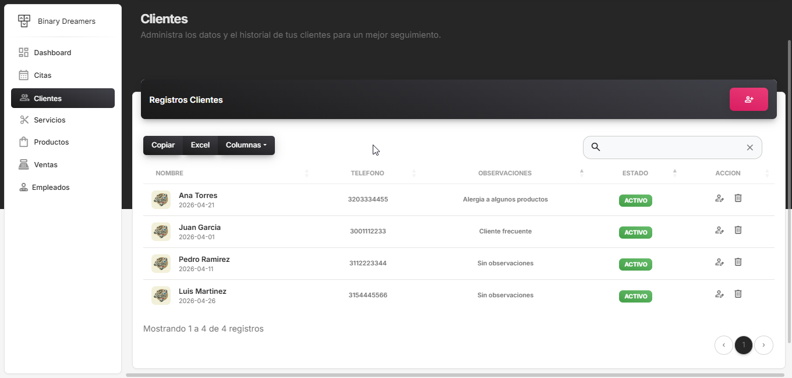
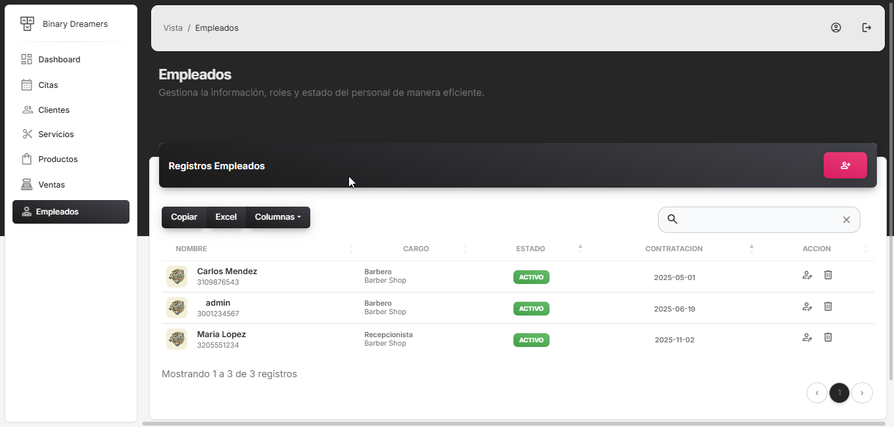
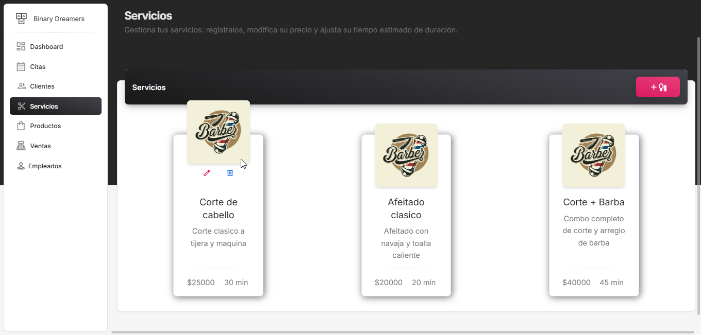
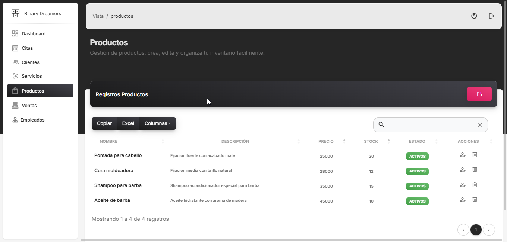
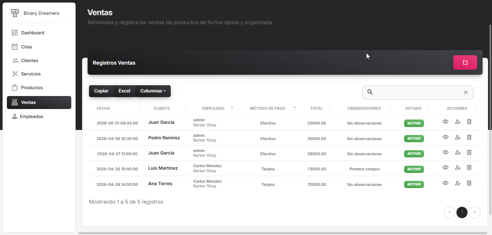

# BarberShop — Sistema de Gestión

Sistema de administración para barberías desarrollado en PHP con arquitectura MVC. Centraliza la gestión de citas, empleados, servicios, productos y ventas en un solo panel de control.

---

## Contenidos

- [Vista General](#vista-general)
- [Módulos del Sistema](#módulos-del-sistema)
- [Equipo](#equipo)
- [Tecnologías](#tecnologías)
- [Instalación con Docker](#instalación-con-docker)

---


## Módulos del Sistema

### Inicio de Sesión

Acceso al sistema mediante número de teléfono y contraseña. Solo los empleados registrados y activos pueden ingresar al panel.

<div align="center">
  
</div>

---

### Dashboard

Panel central con métricas del negocio en tiempo real: total de ventas del día (citas y productos por separado), número de citas agendadas, gráfica de ingresos a lo largo del tiempo, citas por día de la semana y tasa de ocupación de los empleados. Incluye comparativa con la semana anterior.

<div align="center">
  
</div>
<div align="center">
  
</div>

---

### Gestión de Citas

Agenda visual con calendario interactivo. Permite crear citas con múltiples servicios en secuencia, asignando un empleado diferente a cada uno. El sistema detecta conflictos de horario por empleado en tiempo real e impide agendar sobre citas existentes. Soporta edición, cancelación y notas por cita.

<div align="center">
  
</div>
<div align="center">
  
</div>

---

### Gestión de Clientes

Registro y administración de la cartera de clientes. Permite crear, editar y consultar la información de cada cliente para asociarlo a citas y ventas.

<div align="center">
  
</div>

---

### Gestión de Empleados

CRUD completo del personal de la barbería. Registra nombre, teléfono, cargo, salario y fecha de contratación. Cada empleado tiene credenciales propias para acceder al sistema. Los empleados pueden activarse o desactivarse sin eliminarlos.

<div align="center">
  
</div>

---

### Gestión de Servicios

Catálogo de servicios ofrecidos por la barbería. Cada servicio tiene nombre, descripción, precio, duración en minutos e imagen. Las imágenes se redimensionan automáticamente a 200×200 px al subirse. Los servicios se muestran en tarjetas visuales y pueden editarse o eliminarse.

<div align="center">
  
</div>

---

### Gestión de Productos

Inventario de productos disponibles para venta (ceras, aceites, accesorios, etc.). Controla el stock disponible de cada producto y lo actualiza automáticamente al registrar o cancelar ventas.

<div align="center">
  
</div>

---

### Gestión de Ventas

Registro de ventas de productos con múltiples ítems por transacción. Asocia la venta a un cliente y un empleado, registra el método de pago y descuenta el stock automáticamente. Las ventas pueden cancelarse, lo que restaura el inventario afectado.

<div align="center">
  
</div>

---

## Equipo

| Rol | Nombre | GitHub |
|-----|--------|--------|
| **Scrum Master** | Camilo Vanegaz *(Instructor SENA)* | — |
| **Development Leader** | Nicolas Morales | [](https://github.com/NicolasMoralesC10) |
| **Team** | Sean Paul Moreno | [](https://github.com/Paul4357) |
| **Team** | Juan Esteban Gonzalez | [](https://github.com/JuanesGonzalez17) |

---


## Tecnologías

| Tecnología | Versión |
|------------|---------|
| PHP | 8.2 |
| MySQL | 8.0 |
| Apache | 2.4 |
| Docker | 20.10+ |

---

## Instalación con Docker

> **Requisito:** Tener Docker instalado. Si no lo tenés, descargalo en [docker.com/get-started](https://www.docker.com/get-started/) — es gratuito e incluye todo lo necesario.

### 1. Clonar el repositorio

```bash
git clone https://github.com/tu-usuario/barbershop.git
cd barbershop
```

### 2. Levantar los contenedores

```bash
docker compose up --build -d
```

Esto construye la imagen e inicia dos servicios automáticamente:
- **app** — PHP 8.2 + Apache en `http://localhost:8080`
- **mysql** — Base de datos MySQL en el puerto `3306`

La base de datos se importa sola al primer arranque. La primera vez tarda unos minutos.

### 3. Listo

Abrí `http://localhost:8080` en tu navegador.

Credenciales por defecto:

| Campo | Valor |
|-------|-------|
| Teléfono | `3001234567` |
| Contraseña | `12345` |

### Conectar tu cliente MySQL (opcional)

| Campo | Valor |
|-------|-------|
| Host | `127.0.0.1` |
| Puerto | `3306` |
| Usuario | `barber` |
| Contraseña | `barber` |
| Base de datos | `barber_shop` |

### Comandos útiles

```bash
# Ver logs en tiempo real
docker compose logs -f app

# Detener los contenedores
docker compose down

# Detener y borrar la base de datos
docker compose down -v
```
